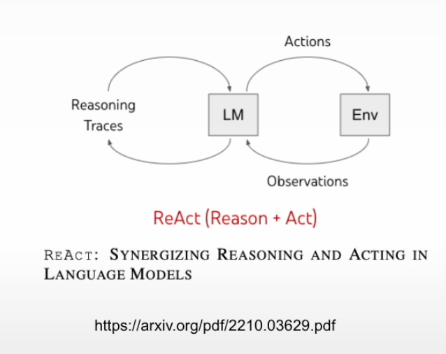
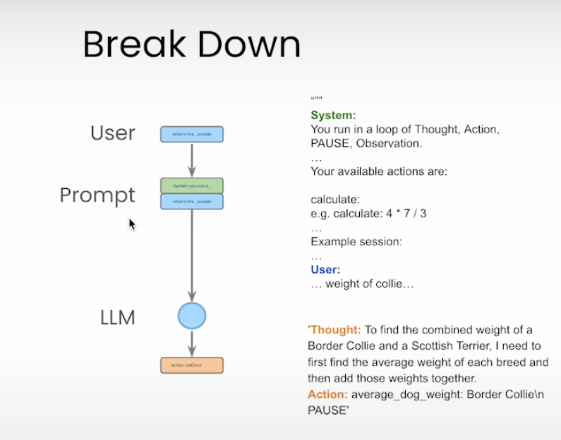

### 本课主要学习了 ReAct-style Agent




| ReAct 特征                         | 你有没有实现？                                 | 说明 |
| ---------------------------------- | ---------------------------------------------- | ---- |
| 🔍 Reasoning trace (`Thought:`)    | ✅ 模型 prompt 中已定义格式                    |      |
| ⚙️ Action 指令输出 (`Action: xxx`) | ✅ 用 regex 自动提取                           |      |
| 🔧 Tool dispatching                | ✅ `known_actions[action](action_input)`       |      |
| 👁️ Observation 反馈                | ✅ 回传 `"Observation: ..."` 给模型            |      |
| 🔁 多轮对话循环                    | ✅ 用 `while i < max_turns` 实现了对话控制     |      |
| 🔒 安全控制                        | ⚠️ `eval()` 存在风险（仅建议在受控环境下使用） |      |
| ✅ Tool registry                   | ✅ `known_actions = {...}` 显式管理工具映射    |      |
| 📜 Prompt 模板设定                 | ✅ 精心设计了 ReAct 指令式 prompt              |      |
| 🧠 Agent 状态维护                  | ✅ `self.messages` 中完整保存历史上下文        |      |

总体架构回顾
你实现的逻辑遵循了 ReAct 的标准结构：

```css
User → LM (Thought → Action → PAUSE) → Tool → Observation → LM → Answer
```

每轮循环：

- LLM 判断问题 → 输出行动 → 停止（PAUSE）
- 工具执行 → 产生 observation
- observation 回传给 LLM → 再次 Reason or Answer

这就是 ReAct 精髓所在 ✅

### 为什么要分为三种角色, system，user 和 assistant

✅ 三种角色解释

1. system
   定义 assistant 的行为、身份、语气、知识范围等
   通常在对话开始时给出，一般只出现一次
   帮助模型“进入角色”，为整个对话定下基调

示例：

```json
{ "role": "system", "content": "You are a helpful travel assistant." }
```

2. user
   代表用户输入（你的问题、请求、命令）
   可以多次出现，构成对话内容的核心

示例：

```json
{ "role": "user", "content": "What's the weather like in Sydney today?" }
```

3. assistant
   表示模型（也就是 GPT）生成的回答
   每次 chat.completions.create() 返回的结果，都会以 role="assistant" 的形式加入对话历史
   因为 LLM 是无状态的 —— 每次调用都需要你提供完整的上下文（包括历史问答），模型才知道它“之前说了什么”。
   模型会根据 所有这些 history（包括 assistant 的历史回答） 来决定如何回应最后一条 user 问句

示例：

```json
{ "role": "assistant", "content": "It's sunny and 25°C in Sydney today." }
```

📚 为什么要区分这三种角色？
| 原因 | 说明 |
| --------- | ------------------------------------------------- |
| 🎭 明确身份 | 帮助模型知道自己是谁（assistant）、谁在说话（user）、有什么设定（system） |
| 🧠 提供上下文 | 模型是通过“上下文提示”来理解任务和对话历史的，区分角色能提供结构化上下文 |
| 💬 支持多轮对话 | 持续地加入 `user` 和 `assistant` 交互，构建完整的多轮对话历史 |
| 🔧 控制行为 | `system` prompt 可用来控制风格、专业度、限制输出范围（如只回答代码、用某种语言等） |

🔁 一个完整的对话示例：

```json
[
  {
    "role": "system",
    "content": "You are a polite assistant who speaks like Shakespeare."
  },
  { "role": "user", "content": "What's the time?" },
  { "role": "assistant", "content": "The hour is late, fair traveler." },
  { "role": "user", "content": "What's the weather in Paris?" }
]
```

模型会根据这些消息来生成下一个 "assistant" 的回复。

✅ 总结
| 角色 | 作用 |
| ----------- | ----------------------- |
| `system` | 设定模型的行为和身份，通常在对话开头一次性使用 |
| `user` | 表示用户输入，构成对话的请求部分 |
| `assistant` | 模型生成的响应，用于保持上下文和多轮对话 |

这三类角色组合起来，使得对话可以变得有逻辑、可控、多轮且高度上下文感知。你在构建 agent 或多轮聊天系统时，合理使用它们是非常关键的。

### 为什么这个“tool-calling agent”可以被称为 AI agent

✅ 什么是 AI Agent？
在人工智能领域，AI agent 指的是：一个能够感知环境、做出决策并采取行动以实现目标的系统。

这个定义来源于经典的人工智能教材（如 Russell & Norvig 的 Artificial Intelligence: A Modern Approach）。

一个 AI agent 具备以下核心特征：
| 特征 | 描述 |
| --------------- | ----------------------- |
| 感知（Perceive） | 能接收输入（例如用户指令、数据、上下文） |
| 决策（Reason/Plan） | 能根据输入选择合适的策略或工具 |
| 行动（Act） | 执行某种行为，例如回答问题、调用工具、返回结果 |
| 反馈（React/Learn） | 有时还能根据结果进行自我调整（可选） |

✅ Tool-Calling Agent 是怎么工作的？
以你提到的“tool-calling agent”（例如使用 OpenAI Function Calling 或 LangChain agent）为例：

1. 接收用户输入：如 "What's the weather in Tokyo?"

2. 判断是否需要调用工具（感知 + 推理）：判断用户的问题不是直接回答，而是要调用 get_weather() 工具

3. 构造 API 调用并执行（行动）：向天气工具发起查询

4. 整合结果并输出（完成任务）：返回 "The current weather in Tokyo is 25°C and sunny."

👉 它理解目的、选择方法、调用工具、完成任务，这就是“代理（agent）”的典型模式。

✅ 所以，tool-calling agent 是 AI agent 吗？
是的，因为它符合 AI agent 的定义：

- 它能自动决定何时使用工具
- 它能感知用户的意图
- 它能采取行动来实现目标（调用工具）
- 它体现了“思考 → 行动”的 loop

这类 agent 并不是死板的脚本，而是具备一定“智能”的行为协调器。

🔁 举个比喻：
把 AI agent 想象成一个助理：

你说：“订个披萨给我。”
助理分析：“这不是我能直接回答的问题，我要调用外卖 app。”
然后去 app 下单，并告诉你“已下单，30 分钟送达”。

这就是 AI agent 的体现，而 tool-calling 就是它“打电话订餐”的能力。
