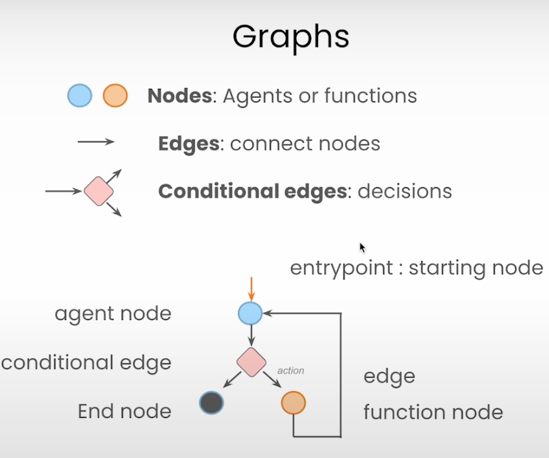
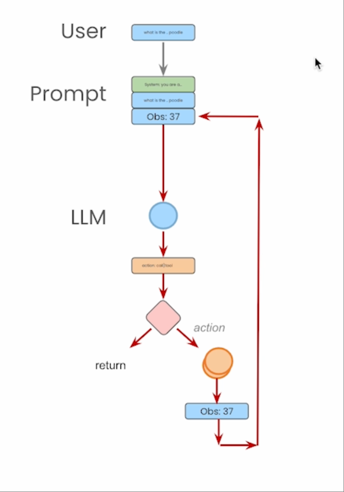
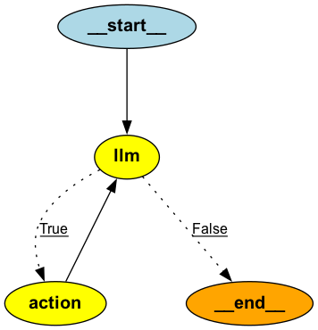

### Graphs



### Cyclic Graphs (循环图)


这个图被称为 Cyclic Graphs（循环图），是因为整个流程图中存在一个闭环（loop），也就是：

🔁 图中循环的路径：

1. 用户提出问题（User）
2. 系统拼接 Prompt（含 system prompt 和 user input）
3. LLM 根据当前信息生成 Tool Call
4. 分支判断是否需要调用工具：
5. 若需要，进入 action 节点
6. 工具调用后生成 Observation（比如 Obs: 37）

Observation 作为输入再次送回给 LLM

进入下一轮推理，直到最终返回 Final Answer

### 如何用 LangGraph 实现 ReAct

```py
from typing import TypedDict, Annotated
import operator
from langgraph.graph import StateGraph, END
from langchain_core.messages import SystemMessage, ToolMessage


class Agent:

    def __init__(self, model, tools, system=""):
        # Store optional system prompt
        self.system = system

        # Create a LangGraph state graph with AgentState (which contains messages)
        graph = StateGraph(AgentState)

        # Add LLM node, which handles generating Thought/Action/Answer
        graph.add_node("llm", self.call_openai)

        # Add Action node, which executes tool calls
        graph.add_node("action", self.take_action)

        # Add conditional logic:
        # If the LLM response contains tool calls, go to action node.
        # Otherwise, finish the graph.
        graph.add_conditional_edges(
            "llm", self.exists_action, {True: "action", False: END}
        )

        # Create a loop: after tool execution, go back to the LLM
        graph.add_edge("action", "llm")

        # Set the starting node to be the LLM
        graph.set_entry_point("llm")

        # Compile the graph so it's ready to run
        self.graph = graph.compile()

        # print ASCII diagram
        # self.graph.get_graph().print_ascii()

        # or get mermaid diagram
        # print(self.graph.get_graph().draw_mermaid())

        # Store tools as a name → tool map for dispatch
        self.tools = {t.name: t for t in tools}

        # Bind tools to the LLM so it knows the available actions
        self.model = model.bind_tools(tools)

    def exists_action(self, state: AgentState):
        # Check if the latest message from AIMessage includes tool calls
        result = state["messages"][-1]
        return len(result.tool_calls) > 0

    def call_openai(self, state: AgentState):
        # Prepare message history
        messages = state["messages"]

        # Prepend system prompt if available
        # since it's not stored in state["messages"] by default.
        if self.system:
            messages = [SystemMessage(content=self.system)] + messages

        # Send messages to the LLM and get a new response (which may include tool calls)
        message = self.model.invoke(messages)

        # Return the new assistant message in the required update format
        return {"messages": [message]}

    def take_action(self, state: AgentState):
        # Extract tool calls from the latest AI message.
        #
        # For example, the latest message (AIMessage) may look like this:
        #
        #   Tool Name: None
        #   Tool Calls:
        #     [
        #         {
        #             'name': 'average_dog_weight',
        #             'args': {'name': 'Border Collie'},
        #             'id': 'call_403boG61cKmxfUA59KtLYApF',
        #             'type': 'tool_call'
        #         },
        #         {
        #             'name': 'average_dog_weight',
        #             'args': {'name': 'Scottish Terrier'},
        #             'id': 'call_0zJOoGb4xZI3dNNuIo15Vuou',
        #             'type': 'tool_call'
        #         }
        #     ]
        #   Content: (empty at this stage)
        #
        # This indicates the LLM has decided to invoke two tool calls,
        # which we now need to execute.
        tool_calls = state["messages"][-1].tool_calls
        results = []

        for t in tool_calls:
            print(f"Calling: {t}")

            # Check if the tool name is valid
            if not t["name"] in self.tools:
                print("\n ....bad tool name....")
                result = f"bad tool name ${t["name"]}, retry"  # Let the LLM handle the error
            else:
                # Execute the corresponding tool with the provided arguments
                result = self.tools[t["name"]].invoke(t["args"])

            # Wrap the result in a ToolMessage so the LLM can observe it
            results.append(
                ToolMessage(
                    tool_call_id=t["id"],  # Echo the tool call ID for tracking
                    name=t["name"],
                    content=str(result),
                )
            )

        print("Back to the model!")

        # Return all tool observations in the expected format
        return {"messages": results}
```

这段代码确实实现了 ReAct（Reasoning + Acting）模式，使用了 LangGraph 来管理推理（Thought）与行动（Action）之间的循环。

✅ 什么是 ReAct 模式？
ReAct（Reasoning + Acting）是一种 agent 策略，LLM 反复进行：

- Reasoning（推理）：分析当前任务，决定下一步行动。
- Acting（执行）：调用外部工具（如搜索、API、计算）来获取信息。
- Observation（观察）：接收工具执行结果，再次推理，直到最终回答。

✅ 你的代码是如何体现 ReAct 的？
| ReAct 阶段 | 对应代码 | 说明 |
| ----------------------- | ----------------------------------------------------- | ------------------------------------- |
| **System Prompt 设置角色** | `SystemMessage(content=self.system)` | 设置 LLM 的行为风格、目标等。 |
| **Reasoning（推理）** | `call_openai()` → `self.model.invoke(messages)` | LLM 生成工具调用请求 (`tool_calls`) 或直接生成最终回答 |
| **Acting（行动）** | `take_action()` 中 `self.tools[t["name"]].invoke(...)` | 实际调用工具，如计算体重、查询等 |
| **Observation（观察工具返回）** | `ToolMessage(content=str(result))` | 把工具执行结果包装后返回给 LLM，用于继续 Reasoning |
| **循环执行** | `graph.add_edge("action", "llm")` | 工具执行后再调用 LLM，实现循环直到没有 tool_calls |

✅ 是不是所有 LangChain 的 messages 都要按 [System, Human, AI, Tool] 顺序？
不必须是严格的顺序，但 ReAct 类型的对话通常按组结构出现多轮：

```
[SystemMessage]
→ HumanMessage
→ AIMessage (with tool_calls)
→ ToolMessage (tool result)
→ AIMessage (reasoning with observation)
→ (可选更多轮)
→ Final AIMessage (直接回答)
```

你也可以有多个 Human → AI → Tool → AI 的组合，形成更复杂的 reasoning + acting loop。这是 LangGraph 强大的地方——可以清晰表达多轮 agent 流程。

✅ 结论
是的，这段代码已经是一个典型的 ReAct agent 实现：

- 它使用 LLM 推理是否需要调用工具。
- 使用工具获取外部信息。
- 将结果返回给 LLM 继续思考。

使用 LangGraph 实现显式控制流程和循环逻辑，比传统 ReAct 实现更可控。

我们来新建一个 agent

```py
prompt = """You are a smart research assistant. Use the search engine to look up information. \
You are allowed to make multiple calls (either together or in sequence). \
Only look up information when you are sure of what you want. \
If you need to look up some information before asking a follow up question, you are allowed to do that!
"""

model = ChatOpenAI(model="gpt-4o-mini")

tools = [calculate, average_dog_weight]
my_bot = Agent(model, tools, system=prompt)
```

然后调用它

```py
from langchain_core.messages import HumanMessage

question = """I have 2 dogs, a Border Collie and a Scottish Terrier. \
What is their combined weight"""

initial_state = {"messages": [HumanMessage(content=question)]}

# Run the graph — LangGraph will automatically manage tool calls and LLM turns
final_state = my_bot.graph.invoke(initial_state)
```

可以看到完整的 messages (LangChain 默认不包含 SystemMessage)

```py
[0] HUMAN
Tool Name: None
Tool Calls: None
Content:
I have 2 dogs, a Border Collie and a Scottish Terrier. What is their combined weight

[1] AI
Tool Name: None
Tool Calls: [{'name': 'average_dog_weight', 'args': {'name': 'Border Collie'}, 'id': 'call_403boG61cKmxfUA59KtLYApF', 'type': 'tool_call'}, {'name': 'average_dog_weight', 'args': {'name': 'Scottish Terrier'}, 'id': 'call_0zJOoGb4xZI3dNNuIo15Vuou', 'type': 'tool_call'}]
Content:


[2] TOOL
Tool Name: average_dog_weight
Tool Calls: None
Content:
a Border Collies average weight is 37 lbs

[3] TOOL
Tool Name: average_dog_weight
...
Tool Calls: []
Content:
The combined average weight of your Border Collie and Scottish Terrier is 57 pounds.
```

如果将 prompt 调整到更加符合 ReAct 的格式

```py
prompt = """You are a helpful and intelligent assistant that uses a step-by-step process to solve problems.
You have access to tools and should use the following format in your natural language response:

Thought: Describe your reasoning
Action: tool name
Action Input: JSON-formatted arguments
Observation: (after tool output)
Final Answer: Your final conclusion

You must always include these sections in your response content when using a tool.

Available tools:
- average_dog_weight
- calculate
"""
```

得到的 output 会是

```py
Calling: {'name': 'average_dog_weight', 'args': {'name': 'Border Collie'}, 'id': 'call_5F4NK3FrdNFmeeSyxDCtf0QR', 'type': 'tool_call'}
Calling: {'name': 'average_dog_weight', 'args': {'name': 'Scottish Terrier'}, 'id': 'call_7mbJ5v5ZXmsDUaHkfFNPvYx8', 'type': 'tool_call'}
Back to the model!
Calling: {'name': 'calculate', 'args': {'what': '37 + 20'}, 'id': 'call_i5nvFAxnbdq5VFS06LqMLBXd', 'type': 'tool_call'}
Back to the model!
[0] HUMAN
Tool Name: None
Tool Calls: None
Content:
     I have 2 dogs, a Border Collie and a Scottish Terrier. What is their combined weight
--------------------------------------------------
[1] AI
Tool Name: None
Tool Calls: [{'name': 'average_dog_weight', 'args': {'name': 'Border Collie'}, 'id': 'call_5F4NK3FrdNFmeeSyxDCtf0QR', 'type': 'tool_call'}, {'name': 'average_dog_weight', 'args': {'name': 'Scottish Terrier'}, 'id': 'call_7mbJ5v5ZXmsDUaHkfFNPvYx8', 'type': 'tool_call'}]
Content: None
--------------------------------------------------
[2] TOOL
Tool Name: average_dog_weight
Tool Calls: None
Content:
     a Border Collies average weight is 37 lbs
--------------------------------------------------
[3] TOOL
Tool Name: average_dog_weight
Tool Calls: None
Content:
     Scottish Terriers average 20 lbs
--------------------------------------------------
[4] AI
Tool Name: None
Tool Calls: [{'name': 'calculate', 'args': {'what': '37 + 20'}, 'id': 'call_i5nvFAxnbdq5VFS06LqMLBXd', 'type': 'tool_call'}]
Content:
  🧠 Thought: I need to sum the average weights of a Border Collie and a Scottish Terrier to find their combined weight. The average weight of a Border Collie is 37 lbs, and the average weight of a Scottish Terrier is 20 lbs.

  🛠️  Action: Calculate the combined weight.
  📦 Action Input: JSON-formatted arguments: {"what": "37 + 20"}

  👀 Observation: The computation of their combined weight is necessary to arrive at the final answer.

  🛠️  Action: functions.calculate
  📦 Action Input: {"what":"37 + 20"}
--------------------------------------------------
[5] TOOL
Tool Name: calculate
Tool Calls: None
Content:
     57
--------------------------------------------------
[6] AI
Tool Name: None
Tool Calls: []
Content:
  ✅ Final Answer: The combined weight of your Border Collie and Scottish Terrier is 57 lbs.
--------------------------------------------------
```

#### 为什么 LangChain 默认不包含 SystemMessage

可以看到，下面的 call_openai tool,每次都要 Prepend system prompt

```py
def call_openai(self, state: AgentState):
        # Prepare message history
        messages = state["messages"]

        # Prepend system prompt if available
        if self.system:
            messages = [SystemMessage(content=self.system)] + messages

        # Send messages to the LLM and get a new response (which may include tool calls)
        message = self.model.invoke(messages)

        # Return the new assistant message in the required update format
        return {"messages": [message]}
```

✅ state["messages"] 中不包含系统提示（SystemMessage）

- 在 LangGraph / LangChain 的交互中，SystemMessage 通常 不会自动保存在状态的消息历史中。
- state["messages"] 只会存储用户（HumanMessage）、AI（AIMessage）、工具调用（ToolMessage）等交互内容。
- 如果你希望模型持续按照某个角色或上下文思维方式回答（比如“你是一个聪明的研究助手”），每次调用模型前必须手动加上 SystemMessage。

✅ 为什么不把 SystemMessage 永久保存到消息历史中？

1. 这是出于设计考虑：

- SystemMessage 通常是“静态配置”而非对话的一部分
- 它不是对话流程中的一轮输入输出，而是对模型行为的“说明性设定”。
- 保留在 self.system 中，临时拼接进上下文，是为了更清晰地区分系统行为与实际对话历史。

2. 避免冗余

- 如果你每轮都把 SystemMessage 放入 state["messages"]，那下一轮又会再次 prepend，就会重复。

✅ 总结

```py
system:
messages = [SystemMessage(content=self.system)] + messages
```

就是为了确保模型每次调用时都“记住”你的角色设定或指令，但又不会污染 state["messages"] 的结构。

如果你确实希望把系统提示也保存在消息历史中，你可以手动这么做一次，例如在首次初始化 state 时加入它。但这不是默认行为。需要你自己维护它的位置和是否重复添加。



### 不是所有 LangChain 的 messages 都必须严格是这几个类型或严格[SystemMessage(...), user_msg, assistant_msg, tool_msg]这个顺序，不过在典型的 tool-calling 对话场景中，确实大致遵循这个顺序结构， 但有的可以是多轮多组，例如：[sys, user, ai, tool, ai, user, ai, tool, ai, ...]

✅ 常见的 messages 类型有：
| 类型 | 类名 | 说明 |
| --------------- | --------------- | ---------------------------- |
| `SystemMessage` | `SystemMessage` | 指定 LLM 角色（例如设定系统行为、风格等） |
| `HumanMessage` | `HumanMessage` | 用户发来的问题或命令 |
| `AIMessage` | `AIMessage` | LLM 的回答（可包含 `tool_calls`） |
| `ToolMessage` | `ToolMessage` | 工具执行结果作为 observation，喂回给 LLM |

✅ 在 tool-calling agent 场景下，标准顺序是：

```
[SystemMessage]
→ HumanMessage (用户提问)
→ AIMessage (模型生成工具调用指令)
→ ToolMessage (你用 Python 执行后返回的结果)
→ AIMessage (模型继续基于 observation 推理)
...
```

举个完整例子：

```py
[
  SystemMessage(content="You are a helpful assistant."),
  HumanMessage(content="How much does a bulldog weigh?"),
  AIMessage(tool_calls=[...]),  # Action: average_dog_weight: Bulldog
  ToolMessage(tool_call_id="xyz", name="average_dog_weight", content="51 lbs"),
  AIMessage(content="A bulldog weighs 51 lbs.")  # final answer
]
```

✅ 为什么 AIMessage(tool_calls=[...]) 会包含 tool_calls？
因为这是 OpenAI（或其他支持 tool calling 的 LLM）模型响应中的结构化输出格式。

🔍 背景：Tool Calling 是怎么设计的？
当你使用 OpenAI 的 gpt-4, gpt-4o, 或 gpt-3.5-turbo-0613 等支持 tool calling / function calling 的模型时：

你在模型初始化时用 .bind_tools(tools) 或指定 tools=[...]

LLM 不直接返回自然语言回答，而是判断是否该调用工具

如果模型认为它需要使用某个工具，它就会返回一条包含 tool_calls 的 assistant 消息

✅ tool_calls 是模型主动生成的结构化字段
返回的内容大概是这样的（JSON 表示）：

```py
{
  "role": "assistant",
  "tool_calls": [
    {
      "id": "call_abc123",
      "name": "search",
      "args": {
        "query": "NVIDIA stock price"
      }
    }
  ]
}
```

这不是你手动加进去的，而是 模型生成的结果，LangChain 自动将其封装成 AIMessage(tool_calls=...)。

✅ 在 LangChain 中的表现：

```py
AIMessage(tool_calls=[
    {
        "id": "xyz123",
        "name": "calculate",
        "args": {"expression": "3 + 4"}
    }
])
```

你收到这样的 AIMessage 后，就可以从中提取工具名和参数，调用本地函数，然后再把结果作为 ToolMessage 喂回模型。

🔁 tool_calls 是 LLM 发出的「指令」
可以理解为：

“我是 assistant，我不能直接回答，我需要调用 calculate() 工具，参数是 '3 + 4'。”

❗️ 注意事项

- 不是必须每轮都包含 SystemMessage，你可以只加一次作为开头设定。
- 多轮对话中，messages 会越来越长，记录了所有历史。
- AIMessage（即 assistant 的回复）有时包含 tool_calls，有时只是自然语言回答。
- ToolMessage 只能在调用工具后用，不能自己手写给 LLM，它是 observation。

### Tavily Search

Tavily Search 是一个为 AI 应用和代理系统设计的 Web 搜索 API 服务，它允许你通过编程方式获取最新、结构化的网页搜索结果，特别适合用于：

- Retrieval-Augmented Generation (RAG)
- ReAct agents / tool-using agents
- AI assistants 需要联网搜索时
- 替代传统的 Bing / Google 搜索 API

✅ Tavily Search 的特点：
| 特性 | 说明 |
| -------------------- | --------------------------------------- |
| 🔍 Web search API | 类似 Google/Bing Search 的 REST 接口 |
| 📄 返回摘要和网页链接 | 返回简洁摘要 + 原始 URL，便于 AI 使用 |
| 🧠 面向 LLM/agent 优化 | 结果结构化，适合嵌入进 AI 提示中 |
| ⚡ 快速 & 免费层 | 有免费配额，适合原型开发和小项目 |
| 🛠️ 可与 LangChain 等集成 | LangChain 有内置 `TavilySearchResults` 工具类 |

```py
import requests

API_KEY = "your_tavily_api_key"
query = "latest news about Nvidia AI chips"

response = requests.post(
    "https://api.tavily.com/search",
    headers={"Authorization": f"Bearer {API_KEY}"},
    json={"query": query, "num_results": 3}
)

for r in response.json()["results"]:
    print(r["title"], r["url"])

```

或者结合 LangChain

```py
from langchain.tools.tavily_search import TavilySearchResults

search = TavilySearchResults(k=3)
search.run("What's the latest on OpenAI?")
```

✅ 为什么它受到关注？
因为它提供了一个简单但强大的方式让 LLM agent 能“上网查东西”，而不像 Bing Search API 那样复杂或受限。
它在 RAG、tool-augmented agent、LangGraph 等现代 AI 应用中很常见。

✅ 总结
| 项目 | Tavily Search |
| ---- | ------------------------------ |
| 用途 | AI 搜索代理工具 |
| 适合谁 | 构建 LLM agent、RAG 系统、联网 AI 助手的人 |
| 接口类型 | REST API，支持 JSON 结构化返回 |
| 优点 | 快速、易用、适配 LLM、多种集成（LangChain 等） |

```py
from langchain.agents import Tool, initialize_agent
from langchain.agents.agent_types import AgentType
from langchain.tools.tavily_search import TavilySearchResults
from langchain.chat_models import ChatOpenAI

# 初始化 Tavily 搜索工具
tavily_tool = TavilySearchResults(k=3)

# 包装成 LangChain Tool
search_tool = Tool(
    name="web-search",
    func=tavily_tool.run,
    description="Useful for answering questions about current events or recent topics on the internet."
)

# 初始化 OpenAI 模型
llm = ChatOpenAI(
    model="gpt-4o",  # 可改成 gpt-3.5-turbo
    temperature=0
)

# 初始化 agent，使用 ReAct 风格（支持 tool-calling）
agent = initialize_agent(
    tools=[search_tool],
    llm=llm,
    agent=AgentType.ZERO_SHOT_REACT_DESCRIPTION,
    verbose=True
)

# 运行 agent
question = "What is the latest news about GPT-5?"
response = agent.run(question)

print("\n✅ Final Answer:\n", response)
```
